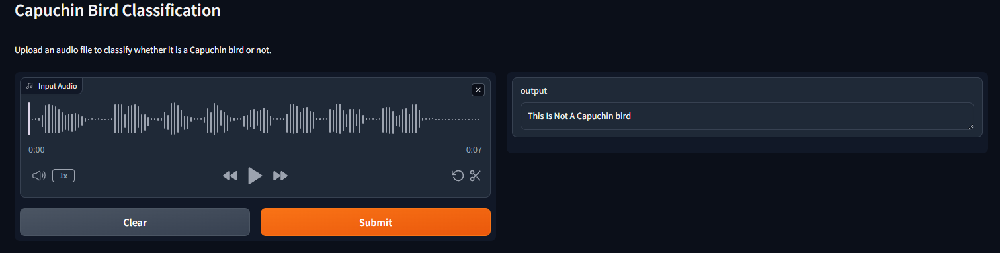

# Capuchin Bird Audio Classifier

An audio classifier for Capuchin bird species implemented in Python using TensorFlow-IO, TensorFlow, NumPy, and Matplotlib. This model classifies audio recordings into different Capuchin bird species.

## Model Link
1. Interact with HuggingFace Space
   https://huggingface.co/spaces/suriya7/Deep-Aduio-Classification

## Introduction

This project focuses on classifying audio recordings of Capuchin bird species using deep learning techniques and TensorFlow-IO. The model is capable of predicting the specific Capuchin bird species present in the audio.

## Dataset

Describe the dataset used for training and testing the model. Include information about the number of classes, the number of audio samples per class, and any preprocessing steps applied to the data.

## Features

- TensorFlow-IO for efficient audio data handling.
- Python implementation for flexibility and ease of use.
- TensorFlow for deep learning model training.
- NumPy for handling numerical operations.
- Matplotlib for visualization of model predictions.

## Requirements

Ensure you have the following prerequisites installed:

- Python 
- TensorFlow-IO 
- TensorFlow 
- NumPy 
- Matplotlib
- gradio

## Screenshots

  
